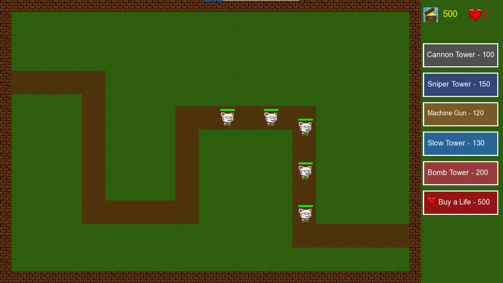

# Tower Defense Rush 🎮

A 2D strategy-based Tower Defense game developed in **C++** using the **SFML (Simple and Fast Multimedia Library)** framework.  
Defend your base against waves of enemies by placing different types of towers strategically across the battlefield.

---

# 📸 Game Preview

<!-- Add your game screenshot here -->


---

# 🚀 Features

✅ Multiple enemy types with unique abilities  
✅ Multiple tower types with different attack styles  
✅ Wave-based enemy spawning system  
✅ Dynamic waypoint enemy movement  
✅ Tower placement validation system  
✅ Coin & life management system  
✅ Health bars for enemies and towers  
✅ Sound effects and animated screens  
✅ Fullscreen SFML gameplay  
✅ Different enemy speeds, HP, and mechanics  
✅ Strategic tower defense gameplay  

---

# 🛠️ Technologies Used

- **C++**
- **SFML Graphics**
- **SFML Audio**

---

# 🎮 Gameplay

- Place towers strategically to defend the path.
- Enemies move through predefined waypoints.
- Destroy enemies to earn coins.
- Buy additional lives using coins.
- Survive all waves to win the game.

---


# 🌊 Wave System

The game contains **5 waves** of increasing difficulty.

| Wave | Enemies |
|---|---|
| Wave 1 | Basic Enemies |
| Wave 2 | Basic + Fast |
| Wave 3 | Tank Enemies Introduced |
| Wave 4 | Flying Enemies Introduced |
| Wave 5 | Omega Boss Appears |

---

# ⚙️ Installation

## 1️⃣ Clone Repository

```bash
git clone https://github.com/zaraaziz07/Tower-Defense-Rush-OOP.git
```

---

## 2️⃣ Install SFML

Download SFML:

https://www.sfml-dev.org/download.php

---

## 3️⃣ Build Project

Compile using:
- Visual Studio
- CodeBlocks
- CLion

Configure:
- SFML Include Path
- SFML Library Path

---

# 🎮 Controls

| Action | Input |
|---|---|
| Place Tower | Left Mouse Click |
| Exit Game | ESC |

---

# 🧠 OOP Concepts Used

✅ Inheritance  
✅ Polymorphism  
✅ Abstraction  
✅ Encapsulation  

### Examples

- `Enemy` base class with derived enemy classes
- `Tower` base class with specialized tower behaviors
- Virtual functions for rendering, attacking, and movement

---

# 🔥 Special Mechanics

## Omega Rage System
Omega enemy becomes faster as its health decreases.

## Slow Tower Effect
Enemies inside the slow tower radius move at reduced speed.

## Bomb Chain Explosion
Bomb tower explosions spread between nearby enemies.

---

# 📌 Future Improvements

- Main Menu
- Tower Upgrades
- Multiple Maps
- Save System
- Background Music
- Better Visual Effects
- More Boss Enemies
- Multiplayer Mode


-
